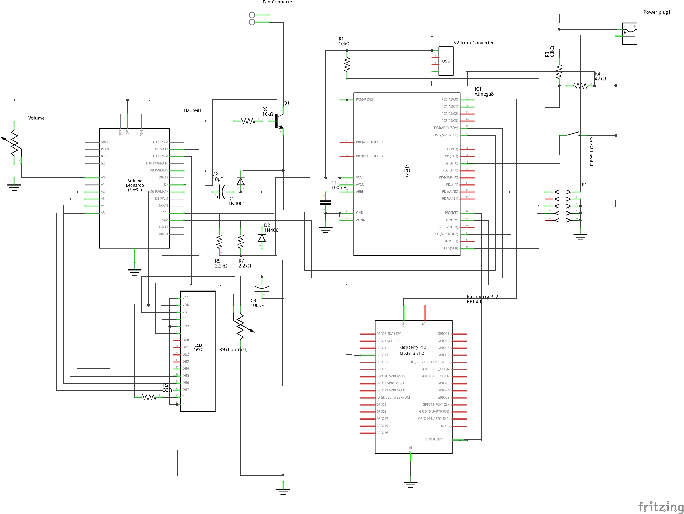

## Overview

The Daddelkiste consists of a Raspberry Pi 4 connected to the official RPi-Display mounted in a Wooden frame. An Arduino Leonardo drives an additional 4X20 Character LCD display showing CPU temperature, Supply Voltage and various other informations. 
A unique feature is the simple on/off switch mechanism with low standby power consumption. For this another Atmega8 microprocessor is used. The design also features fan control which activates a fan at a certain threshold temperature, as well as a volume control with analog feel.

## Schematic

## Protocols / Communication

### Raspberry Pi <-> Arduino
The Raspberry Pi and the Arduino communicate over Serial USB. The possible messages received by the arduino are as follows
* F<number from 0 to 255>\n: Sets the Fan to a specific speed, 0 is off, 255 is full speed
* A<0 or 1>\n: Switches the audio amplifier off or on, 0 is off 1 is on
* D<0 to 3><Text (max 20 chars)>\n: Display th given information on a certain line, ex. "D1CPU Speed: 788MHz\n" displays "CPU Speed: 788MHz" on the second line

The Arduino send the following commands to the Raspberry pi
* VOL(<number from 0 to 1023>)\n: passes the reading of the volume pot to the raspberry pi
* BAT(<number from 0 to 1023>)\n: passes the reading of the supply voltage measurement to the raspberry pi

### Arduino <-> Atmega
The Arduino  and the Atmega communication over i2c with the Arduino only acting as master and the atmega8 only as slave. The commands exchanged are as follows:
* 0x00: Switch the audio amp off
* 0x01: Switch the audio amp on
* 0x02: Request Battery Voltage reading, two bytes must be requested after having issued this command
